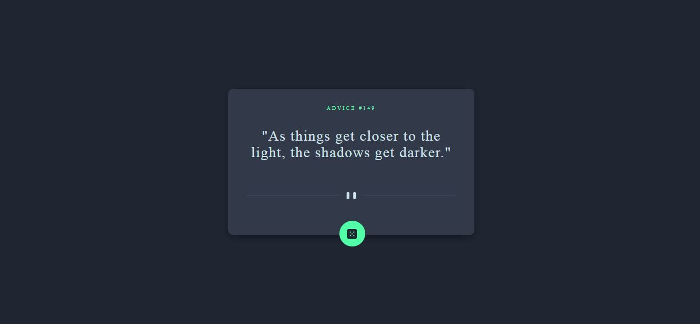
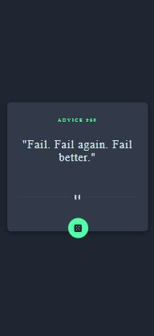

# Frontend Mentor - Advice generator app solution

This is a solution to the [Advice generator app challenge on Frontend Mentor](https://www.frontendmentor.io/challenges/advice-generator-app-QdUG-13db). Frontend Mentor challenges help you improve your coding skills by building realistic projects.

## Table of contents

- [Overview](#overview)
  - [The challenge](#the-challenge)
  - [Screenshot](#screenshot)
  - [Links](#links)
- [My process](#my-process)
  - [Built with](#built-with)
  - [What I learned](#what-i-learned)
- [Author](#author)

## Overview

### The challenge

Users should be able to:

- View the optimal layout for the app depending on their device's screen size

- See hover states for all interactive elements on the page

- Generate a new piece of advice by clicking the dice icon
 

### Screenshot

- Desktop 

- Mobile 

### Links

- [Solution URL here](https://github.com/manishtomarleo21/advice-generator-app-main)
- [Live site URL here](https://manishtomarleo21.github.io/advice-generator-app-main/)

## My process

### Built with

- HTML5 markup
- CSS
- Flexbox
- Mobile-first workflow
- [Advice slip API](https://api.adviceslip.com/#top)

### What I learned

It was a first challenge that i took from FrontEnd Mentor. I learned to work with API and media queries.

## Author

- GitHub [Manish Tomar](https://github.com/manishtomarleo21?tab=repositories)
- FrontEnd Mentor [@manishtomarleo21](https://www.frontendmentor.io/profile/yourusername)
- Twitter [@MaxTomar](https://twitter.com/MaxTomar)

